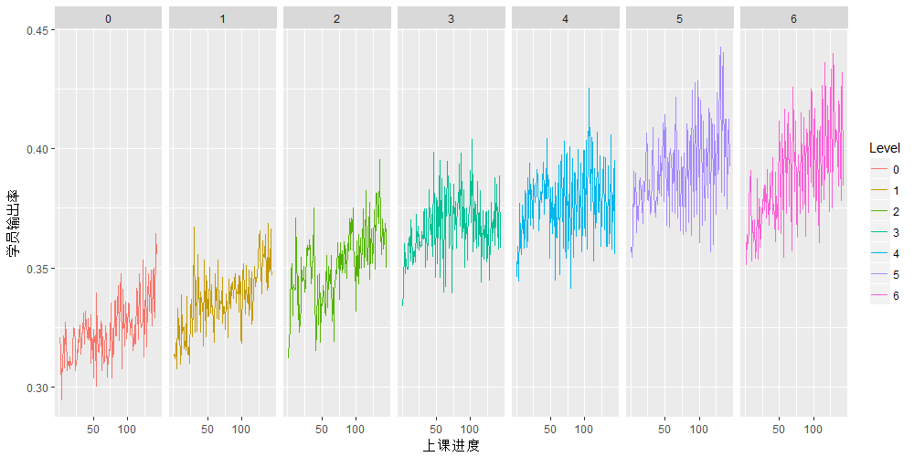
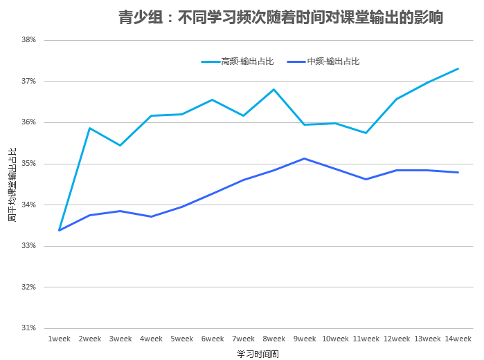
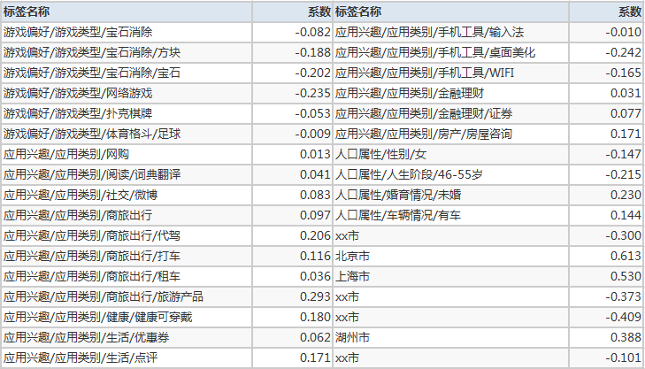
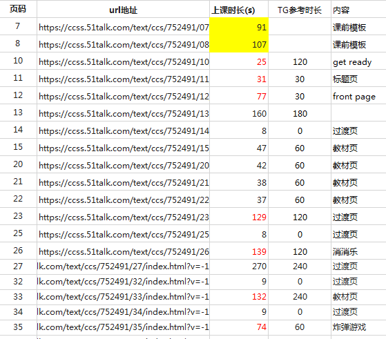
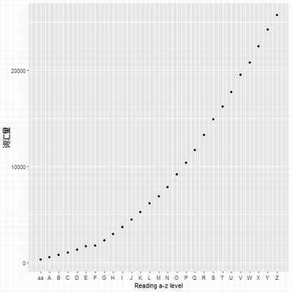
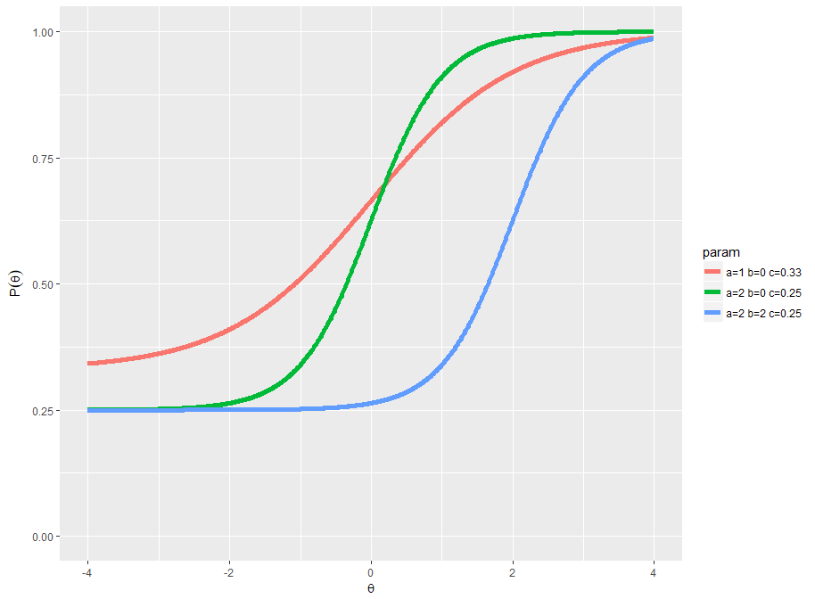
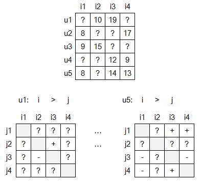

# Outline

1. 在线英语业务概览

2. 营销端优化

  - 什么样的用户是我们的目标用户
  
  - 如何降低运营成本

3. 教育的核心价值

  - 利用数据辅助教材升级和迭代

  - 自适应测评
  
  - 帮学生找到喜欢的老师

---
# 关于51Talk

- 青少、成人、班课三条业务线

- 每天超过50000节课，至今累计输出4000万节课程

- 超过14800名外教，录取率仅为3%

- 基于孩子语言发展规律的核心课程《经典青少英语》

- 自主研发的 AirClass 在线英语学习平台，适应于手机、iPad、电脑

- 2016年6月10日，51Talk登陆美国纽交所

???

35RMB每节课，高频

---
class: middle
# 管中窥豹

<embed src="attach/1853.swf" height="403" width="716"/>

???

- 面向学生的精准化（学习资源和路径的推荐）

- 面向教师的智能化（学情分析和教学资源的评估）

- 面向管理者的高效化（学习效果和成本分析）

1. 基于教育大数据的分析和应用

2. 智能化测评

3. 学习的自适应辅助

---
# 学员说英文的输出比例

---
### 高频学习的表现明显强于低频学习的孩童

.image-wrap[]

高频（每周课耗>=6), 中频（每周课耗3-4节），低频（每周课耗1-2节）

---
# 我们的目标用户长什么样？

???
除去城市特征以外，原始共计561个特征。比如奢侈品、母婴、运动之类的

花絮：湖州是什么鬼？

- 自唐至清末，湖州境内举进士1530人，其中状元16人；

- 湖州籍两院院士共有22人,位居全国第19位；

- 每万人大专以上人数207人,位列全国第15位；

- 人均受教育年限7.27年,位列全国第14位；

- 苏湖教法，由宋代教育家胡瑗创立。

.right[-- 八卦自wikipedia]

---
# 运营优化

面临的挑战：

1. 课程顾问服务成本过高（时间利用率）

2. 经验不丰富的课程顾问在跟进过程中无重点（头部用户的跟进）

3. 销售在新兵营期间会被分配普通用户，造成浪费（新手培养）

解决的办法：

> 注册用户付费概率模型

用户一旦注册，实时的根据用户特征，标记付费意向概率。

通过标记

.red[12%的低付费意愿用户，最终付费率仅相当于另外88%的高意向付费用户的1/9-1/12。]通过策略的配置，
可以很容易控制低付费意愿的流向以及比例。

---
class: inverse, middle, center

# 利用数据辅助教材升级和迭代

---
### 小数据大学问

.center[]

???

- 通过学生的学习反馈数据修正课程结构、单元知识点等。甚至重新组织课程、学习单元、知识点的组织方式

- 对教学产品功能的评估
    
- 通过学生的反馈，对教师教学动作的评估，以及提升方案

---
### Reading A-Z词汇量

.center[]

Reading A-Z是一款著名的英文分级阅读产品，覆盖了美国幼儿园到小学毕业的难度，包括aa,A,B,C,...Z,Z1,Z2 29个级别。
随着级别增大，会出现大量人文历史、科技、军事等领域内容，正常国内四级水平也会感觉有难度。

---
# 我们如何建议课外的阅读？

克拉申的语言输入假说提到，学习者目前的水平为 i，假设 1 为适当的挑战难度，无论 i-1,i+0,i+2 都是不合理的。
对于课外阅读内容，我们希望是 i+1

> 略高于我们的累积教材难度，挑战难度会是5%或者10%

对于95%的词汇量覆盖度，对应CEJ级别学员可以通过自学完成课外阅读：

|CEJ |Level0 |Level1 |Level2 |Level3 |Level4 |Level5 |Level6 |
|--------:|:------:|:------:|:------:|:------:|:------:|:------:|:------:|
|RAZ |aa     |aa     |aa,A,B |B      |B,C    |C,D,E  |E,F,G  |

对于90%的词汇量覆盖度，需要老师或家长辅助：

|CEJ |Level0 |Level1 |Level2 |Level3 |Level4 |Level5 |Level6 |
|--------:|:------:|:------:|:------:|:------:|:------:|:------:|:------:|
|RAZ |aa     |aa,A,B |B,C,D  |D,E,F,G |G,H    |H,I,J,K,L,M |M,N,O,P,Q,R |

???

同时对标了 

人教版、剑桥少儿英语

---
## 教学过程监控

<embed src="attach/teacher.swf" align="center" height="405" width="720"/>

- 提供了 angry，happy，neutral，sad，surprise 五种表情标记

- 追踪老师的情绪对教学效果的影响

???

1. 获取老师的脸

2. 判断表情标签

三个小时以内处理完每天50000节课的老师表情

---
class: inverse, middle, center

# 自适应测评

---
### Item Rrsponse Thoery - 3PL

IRT理论即项目反应理论(Item Response Theory, IRT)，又称题目反应理论、潜在特质理论（Item Response Theory）是一系列心理统计学模型的总称。在实际应用中，人们出于数值处理的简便，倾向于使用3参数Logistic模型（简称3PL模型，3-parameter Logistic model），3PL模型中，第 $j$ 人做对第 $i$ 题的概率如下：

$$ P_i(\theta _j)=c_i+\frac{(1-c_i)}{1+e^{-\alpha_i(\theta_j-\beta_i))}} $$

- ${\theta_j}$，第 $j$ 人的能力值
- ${\alpha_i}$，第 $i$ 题的区分度(item discrimination)
- ${\beta_j}$，第 $i$ 题的难度(item difficulty)
- $c_i$，第 $i$ 题的猜对概率(guessing parameter)

???

- 1952年Frederic Mather Lord 提出

- 在 Educational Testing Service(ETS) 工作了 33 年（director of statistical analysis）

- has been called the "Father of modern testing."

---
### 不同参数下的3道题

.image-wrap[] 

${\theta}$ 表示学生的能力值， $P_i(\theta)$ 表示学生答对题的概率

???

参数估计利用了

- 极大似然估计方法（Maximum Likelihood Estimate，MLE）

- 最大期望算法（Expectation Maximization Algorithm）

参数：

- ${\alpha_i}$，第 $i$ 题的区分度(item discrimination)
- ${\beta_j}$，第 $i$ 题的难度(item difficulty)
- $c_i$，第 $i$ 题的猜对概率(guessing parameter)

---
# .red[C]mputerised .red[A]daptive .red[T]esting

- step1: 首先从题库中随机调取学生初始等级下的一道题

- step2: 根据学答题情况，以及相应题目的3个参数，估计出当前的**能力值** $\theta^{(s)}$ 

- step3: 根据当前能力值，计算可选题库中对于该能力值 $\theta^{(s)}$ 下的**信息量**

$$I_i(\theta)=\frac{[{P}'_i(\theta)]^2}{P_i(\theta)Q_i(\theta)}$$
选择**信息量最大**的一道题给予学生，继续作答，同时可计算下一步的 $\theta^{(s+1)}$ 估计量的**标准差**
$$ SE = \frac{1}{\sqrt{\sum I_i(\theta)}}$$

- step4: 重复step2-step3，直到标准差在给定的阈值内，或者满足其他停止条件（例如最多只做30题）则结束测试，并给出最后一次估计的能力值 $\theta$ 

???

CAT的优势

1. CATs比传统的Test，试题长度至少**降低 50%** (Weiss & Kingsbury,1984)
1. 在CAT体系下，所有 examinees 的能力测量精度是**一致可对比**的,且测评分值**更准确*
1. 动态出题，某种意义上保证了题目的**安全**
1. Top students不会在简单题上浪费时间，Low students不会因为题目过难而丧失信心
1. **及时**的测评报告
1. 由于以计算机为载体，音频、视频等更**多样的item fomats**

CAT的劣势

1. 如何对 examinees 和 parents 解释和说明
1. 不适合主观题，以及样本很少时估计会有偏差
1. 需要持续的做 IRT 标准化和 CAT 模拟研究

---
class: inverse, middle, center

# 帮学生找到喜欢的老师

---
class:center

???

- 左图示App上学生约课的截图。基本逻辑时学生通过筛选时间来确定可用老师。

- 一般学生家长会优先查看看收藏老师时间，如果收藏的老师时间不可约，则需要找新老师

- 尝试新老师的试错成本很高，学生必须和这位新老师上完一节课之后才能知道是否适合

- 最坏的情况是，上完课还不满意，还需要再选择一位老师

- 如果我们按照老师评分排序，必然不能达到个性化适配学生需求

- 从历史数据上也证明了，约新老师，学生的满意度不超过.red[89%]

- 我们需要找到一种完美方法，个性化的给到推荐结果

---
# 问题抽象

对未上过课的老师估计分数，可以抽象成一个典型的**矩阵补全**的问题。给将矩阵中的0估计出一个合理的数据。

常用的方法是**矩阵分解**。个性化的得分矩阵可以分解成:
$$X = S_{n_s * k} * T_{n_t * k}'$$

- SVD 分解: 使得拟合的 X' 矩阵 跟原始的 X 矩阵最相近(包括数值是0的位置)

- ALS: 使得拟合的 X' 矩阵 跟原始的 X 矩阵最相近(不包含数值是0的位置)

- BPR：使得拟合的矩阵 X'中，原始非零位置的数据都比是零位置的数据大

- BPFR: 使得拟合的矩阵 X'中，每行非零位置的数据的相对大小不变

---
# Bayesian Personalized Favor Ranking

.center[]

如果我们能够找到每个学生的向量和老师的 K 维向量，他们的点乘尽可能的满足每个用户的偏好 `+-`，
那么学生和老师的向量就可以用于推断 `?` 的地方（针对于这个学生的老师排序）。

---
# 展望未来教育

|            | 关键词 | 特征    |  时间跨度  |
| --------:   | :-----   |:--- | :---- |
| 前工业时代     | 私塾、家庭教师      | 水平不一      |   18世纪以前    |
| 工业时代       | 学校、义务教育、学科| 流水线、服从      |   18世纪至今    |
| 后工业时代     | 待定义      | 不依赖地域、个性化  | 即将到来    |

#### 工业时代的标准教育模式：

1. 早上七八点进入教室

2. 每节课40-60分钟，老师负责讲，学生负责听

3. 穿插午餐、体育课

4. 放学后作业

---
# 寄语

- 互联网教育在数据科学领域依然还是蛮荒之地，有太多待探索和开发

- 唯一衡量和评价教学效果的证据在于数据，如何设计以及利用这些数据是持续面临的挑战。

- 我们并不需要发明特殊的教育方法，只需要将已被证明有效的教育元素进行有效地整合，构建一个完整、连贯的学习系统。

- 期待 **教研+技术+产品+数据** 的完美整合形态

???

Prepare - Engage - Reflect
